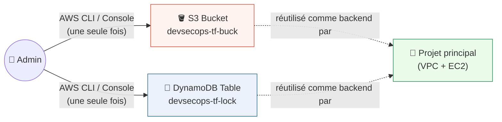
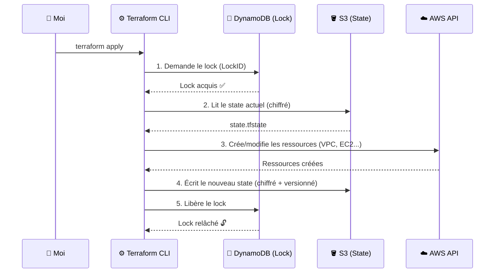

# 🏗️ Provisionnement d'infrastructure AWS avec Terraform

> Documentation rédigée par **Tresor KANGONE** — projet personnel de montée en compétence sur Terraform & AWS, partagé pour celles et ceux qui apprennent l'Infrastructure as Code.

---

## 👋 Pourquoi ce projet

Je voulais un projet concret pour pratiquer Terraform sur AWS, avec les vrais réflexes attendus en entreprise : **gestion du state à distance, verrouillage, chiffrement, séparation des responsabilités** — pas seulement un `terraform apply` qui fonctionne une fois sur ma machine.

Ce dépôt provisionne une petite infrastructure (VPC + 3 instances EC2) en s'appuyant sur un backend distant sécurisé :

**Étude de cas — Backend S3 + DynamoDB** : le state est stocké dans un bucket S3 (versionné, chiffré), et son verrouillage est assuré par une table DynamoDB. ✅ *implémenté dans ce dépôt.*

Avant d'entrer dans le détail, un point important si vous découvrez Terraform.

---

## 📚 Prérequis — notions Terraform indispensables

Ce README suppose une familiarité minimale avec le fonctionnement de Terraform. Si ce n'est pas encore le cas, voici les commandes de base à connaître avant de continuer :

| Commande | Utilité |
|---|---|
| `terraform init` | Initialise le répertoire de travail : télécharge le provider AWS et configure le backend (S3 dans notre cas). **À exécuter en premier, systématiquement.** |
| `terraform validate` | Vérifie que la syntaxe et la cohérence des fichiers `.tf` sont correctes, sans contacter AWS. |
| `terraform fmt` | Reformate automatiquement le code selon les conventions de style Terraform. |
| `terraform plan` | Calcule et affiche ce que Terraform **va faire** (créer/modifier/supprimer) sans rien appliquer. Étape de vérification avant tout `apply`. |
| `terraform apply` | Exécute réellement les changements prévus par le `plan` sur AWS. |
| `terraform destroy` | Supprime toutes les ressources gérées par le state courant. À utiliser avec précaution. |
| `terraform state list` | Liste les ressources actuellement suivies dans le state. |
| `terraform output` | Affiche les valeurs déclarées en `output` (IPs, IDs...) après un `apply`. |

**Concepts clés à avoir en tête :**
- **Le state** (`terraform.tfstate`) est la mémoire de Terraform : il fait correspondre votre code à ce qui existe réellement sur AWS. Le protéger (stockage distant, chiffrement, verrouillage) est une bonne pratique dès qu'on travaille à plusieurs.
- **Le lock** empêche deux `apply` simultanés de corrompre ce state.
- **Les variables** (`variables.tf`, `terraform.tfvars`) permettent de paramétrer le code sans le modifier directement — jamais de valeur sensible en dur.

Si ces notions sont claires pour vous, entrons dans l'architecture du projet.

---

## 🗂️ Arborescence du projet

```
terraform-aws-ec2/
├── .gitignore
├── README.md
└── infra/
    ├── .terraform
    ├── .terraform.lock.hcl # Généré automatiquement par `terraform init` (à committer)
    ├── README.md
    ├── backend.tf          # Configuration du backend distant (S3 + DynamoDB)
    ├── ec2.tf              # AMI + 3 instances EC2
    ├── main.tf             # Provider AWS, VPC, subnets, Internet Gateway, routage
    ├── outputs.tf          # IPs, IDs, informations utiles post-apply
    ├── security_groups.tf  # Security groups (SSH restreint, HTTP/HTTPS)
    ├── terraform.tfvars    # Valeurs de configuration (non sensibles)
    └── variables.tf        # Déclaration de toutes les variables
```

Voyons maintenant comment ces fichiers s'articulent, de la gestion du state jusqu'à la création effective des machines.

---

## 📐 Architecture générale

Le schéma ci-dessous présente la mise en place du backend, puis son utilisation par le projet principal pour provisionner l'infrastructure.



### Légende

| Élément | Rôle |
|---|---|
| **Codes .tf** | Fichiers de configuration Terraform (ressources, provider AWS, backend) |
| **Terraform CLI** | Exécute `terraform init/plan/apply` |
| **S3** | Stocke le state (`terraform.tfstate`), versionné et chiffré |
| **DynamoDB** | Verrouille le state (évite les applies concurrents) |
| **EC2** | Résultat final du `apply` : les 3 machines réellement provisionnées sur AWS |

Le bucket et la table ci-dessus ne sont pas créés par ce projet Terraform — voici pourquoi, et comment ils sont mis en place.

---

## 🔐 Backend S3 + DynamoDB — le détail

### Ce qui se passe à chaque `terraform apply`



> 🎯 Le lock DynamoDB empêche deux `apply` simultanés de corrompre le state. Le versioning S3 permet de revenir en arrière en cas de state corrompu ou d'erreur.

### Mise en place du backend (création manuelle, une seule fois)

Le bucket S3 et la table DynamoDB **doivent exister avant** de pouvoir être utilisés comme backend — ils sont donc créés manuellement, en dehors de tout code Terraform, plutôt que par un projet "bootstrap" séparé.

**a) Créer le bucket S3**

```bash
aws s3api create-bucket \
  --bucket mon-projet-terraform-state \
  --region eu-west-3 \
  --create-bucket-configuration LocationConstraint=eu-west-3
```

**b) Activer le Versioning** (revenir à une version antérieure du state en cas de corruption)

```bash
aws s3api put-bucket-versioning \
  --bucket mon-projet-terraform-state \
  --versioning-configuration Status=Enabled
```

**c) Créer une clé KMS dédiée** (recommandé plutôt que le chiffrement SSE-S3 par défaut, pour contrôler finement qui peut déchiffrer)

```bash
aws kms create-key \
  --description "Cle KMS pour chiffrer le Terraform state" \
  --tags TagKey=Usage,TagValue=terraform-state

aws kms create-alias \
  --alias-name alias/terraform-state-key \
  --target-key-id <KEY_ID_RETOURNE_CI-DESSUS>
```

**d) Activer le chiffrement par défaut du bucket avec cette clé**

```bash
aws s3api put-bucket-encryption \
  --bucket mon-projet-terraform-state \
  --server-side-encryption-configuration '{
    "Rules": [{
      "ApplyServerSideEncryptionByDefault": {
        "SSEAlgorithm": "aws:kms",
        "KMSMasterKeyID": "alias/terraform-state-key"
      },
      "BucketKeyEnabled": true
    }]
  }'
```

**e) Bloquer tout accès public** (le state peut contenir des données sensibles : IP, IDs de ressources, parfois des secrets en clair)

```bash
aws s3api put-public-access-block \
  --bucket mon-projet-terraform-state \
  --public-access-block-configuration \
  BlockPublicAcls=true,IgnorePublicAcls=true,BlockPublicPolicy=true,RestrictPublicBuckets=true
```

**f) Créer la table DynamoDB pour le locking** (clé de partition `LockID` **obligatoire**, imposée par Terraform)

```bash
aws dynamodb create-table \
  --table-name mon-projet-terraform-lock \
  --attribute-definitions AttributeName=LockID,AttributeType=S \
  --key-schema AttributeName=LockID,KeyType=HASH \
  --billing-mode PAY_PER_REQUEST \
  --sse-specification Enabled=true
```

> ✅ Résultat : un bucket S3 versionné, chiffré (KMS), 100% privé, et une table DynamoDB de locking chiffrée.

### Bonnes pratiques appliquées

| Bonne pratique | Pourquoi |
|---|---|
| **Versioning S3 activé** | Restaurer une version antérieure du state en cas de corruption |
| **Chiffrement KMS (CMK)** plutôt que SSE-S3 par défaut | Contrôle fin de qui peut déchiffrer, rotation des clés, audit CloudTrail |
| **Bucket 100% privé** (`block_public_access`) | Le state contient des données potentiellement sensibles |
| **`key` distinct par environnement** (`dev/ec2/terraform.tfstate`) | Isole les states, limite le blast radius |
| **`prevent_destroy` sur le bucket** | Évite une suppression accidentelle de tous les states |
| **`.tfstate` toujours dans `.gitignore`** | Le state ne doit jamais être versionné dans Git |
| **`terraform.tfvars` sans secret** | Seules des valeurs de config (region, CIDR...) y figurent ; tout secret irait dans un fichier local non commité ou un gestionnaire de secrets |

Le backend en place, voyons ce qu'il faut avant de lancer le déploiement.

---

## ⚙️ Prérequis techniques

- Un compte AWS avec des credentials configurés localement (`aws configure` ou variables d'environnement `AWS_ACCESS_KEY_ID` / `AWS_SECRET_ACCESS_KEY` — **jamais en dur dans le code**)
- Une **key pair SSH** déjà créée dans votre compte AWS (pour `var.key_pair_name`)
- Votre IP publique actuelle (pour restreindre `var.my_ip`)

---

## 🚀 Utilisation

```bash
# 1. Le backend (bucket S3 + table DynamoDB) est déjà créé manuellement — voir section précédente

# 2. Personnaliser terraform.tfvars (key_pair_name, my_ip, region...)

# 3. Initialiser puis provisionner le VPC + les 3 EC2
cd infra
terraform init
terraform plan
terraform apply

# 4. Détruire l'infrastructure applicative quand elle n'est plus utile
terraform destroy
```

---

## 🗺️ Roadmap

- [x] Architecture globale
- [x] Backend S3 + DynamoDB (création manuelle, chiffrement, locking)
- [x] VPC + 3 EC2, security groups avec SSH restreint

---

## 📬 À propos

Si ce projet vous a été utile ou que vous avez des suggestions d'amélioration, connectons-nous sur [LinkedIn](https://www.linkedin.com/in/tresor-kangone-739b622a3) !
